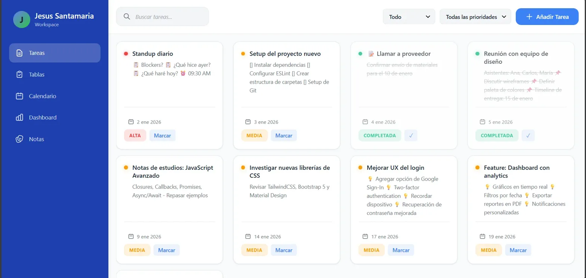
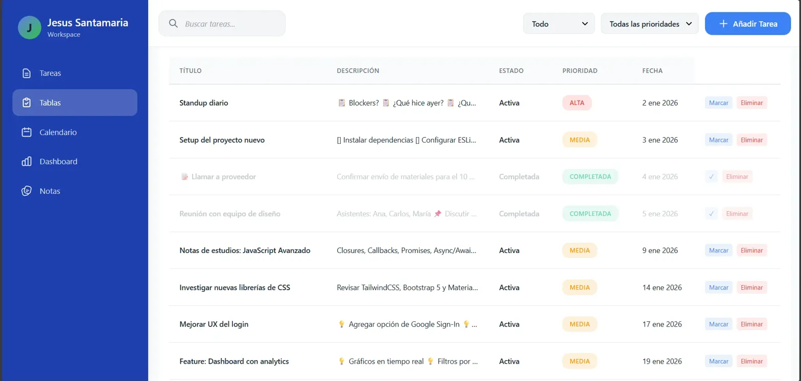
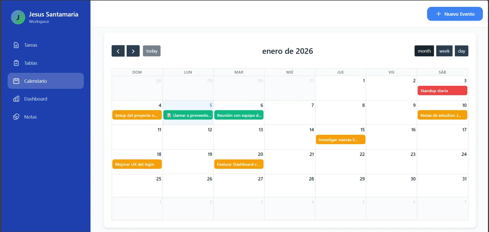
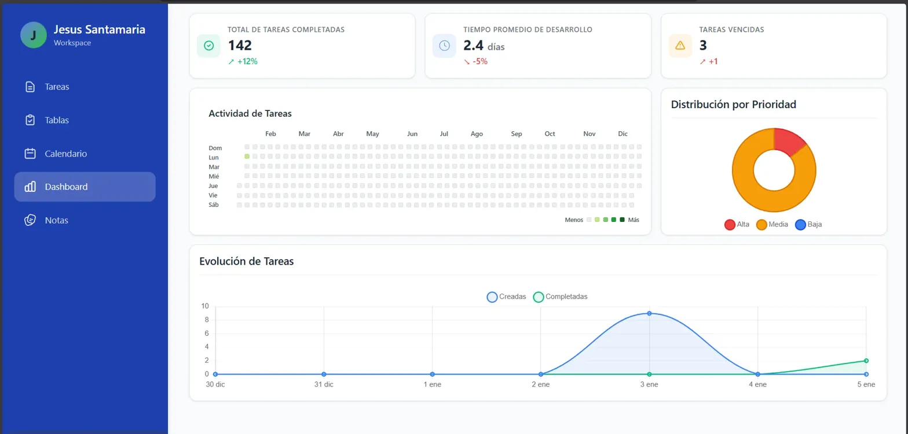
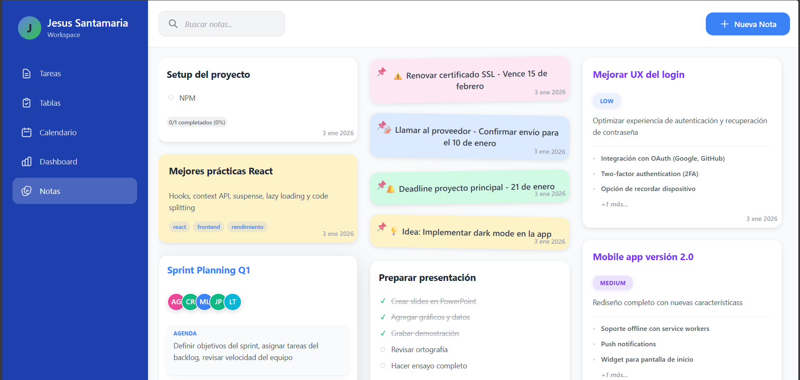

# 🚀 TaskMaster Pro - Sistema de Gestión de Tareas Empresarial

> Plataforma completa de gestión de proyectos con workspace personal, notas colaborativas, calendario inteligente y dashboard analítico en tiempo real

[](tu-url-deploy)


---

## 📸 Capturas de Pantalla

### 🎯 Vista de Tareas (Cards Interactivas)



_Tarjetas dinámicas con información completa de cada tarea: título, descripción detallada, fecha de vencimiento, sistema de prioridades visual (Alta/Media/Baja) y acciones rápidas. Filtros inteligentes por estado y prioridad._

**Características destacadas:**

- 🔍 Búsqueda en tiempo real
- 🎨 Color-coding por prioridad
- ✅ Marcado rápido de completadas
- 📅 Indicadores de fecha visual
- 🗑️ Eliminación con confirmación

---

### 📊 Vista de Tablas (Lista Completa)



_Vista empresarial tipo spreadsheet con todas las tareas organizadas en columnas: Título, Descripción, Estado, Prioridad y Fecha. Perfecta para gestionar grandes volúmenes de información y exportar reportes._

**Características destacadas:**

- 📋 Vista completa de todos los campos
- 🔄 Estados: Activa / Completada
- 🏷️ Tags de prioridad visual
- ⚡ Acciones en línea (Marcar/Eliminar)
- 📈 Ideal para análisis y seguimiento

---

### 📅 Calendario Inteligente



_Calendario mensual totalmente funcional con visualización de tareas por fecha. Navegación entre meses, vista de semana/mes/día, y creación rápida de eventos._

**Características destacadas:**

- 🗓️ Vistas: Month / Week / Day
- ➕ Crear eventos directamente desde el calendario
- 🎨 Color-coding automático por prioridad
- ⏰ Navegación temporal (anterior/siguiente/hoy)
- 📍 Indicadores visuales de carga de trabajo

---

### 📈 Dashboard Analítico



_Panel de control empresarial con métricas en tiempo real, gráficos interactivos y KPIs de productividad._

**Métricas principales:**

- ✅ **Total de Tareas Completadas**: 142 (+12%)
- ⏱️ **Tiempo Promedio de Desarrollo**: 2.4 días (-5%)
- ⚠️ **Tareas Vencidas**: 3 (+1)

**Visualizaciones:**

- 📊 **Actividad de Tareas**: Heatmap estilo GitHub con actividad diaria del año completo
- 📉 **Evolución de Tareas**: Gráfico de líneas comparando tareas creadas vs completadas
- 🥧 **Distribución por Prioridad**: Gráfico circular (Alta/Media/Baja)

---

### 📝 Sistema de Notas Colaborativas



_Nuevo módulo para gestión de notas de proyectos con colaboradores, agendas y acciones pendientes._

**Características destacadas:**

- 👥 **Colaboradores**: Asignación de miembros por iniciales con colores únicos
- 📋 **Secciones organizadas**: Agenda, Acción, Notas generales
- ✅ **Checklists integrados**: Progreso visual (0/1 completados)
- 🏷️ **Niveles de prioridad**: HIGH, LOW para cada nota
- 📅 **Fechas automáticas**: Timestamp en cada nota

---

## ✨ Características Principales

### 🎯 Gestión Completa de Tareas

- ✅ **CRUD Completo**: Crear, leer, actualizar y eliminar tareas
- 🎨 **Sistema de 3 Prioridades**:
  - 🔴 Alta (Crítico)
  - 🟠 Media (Normal)
  - 🔵 Baja (Cuando sea posible)
- 📊 **Estados Duales**: Activa / Completada
- 📅 **Gestión de Fechas**: Vencimiento y alertas
- 📝 **Descripciones Enriquecidas**: Soporte para emojis y markdown

### 📊 Analytics & Insights

- 📈 **3 Gráficos Interactivos**:
  - Evolución temporal (Chart.js Line)
  - Distribución por prioridad (Chart.js Doughnut)
  - Heatmap de actividad anual (estilo GitHub)
- 🎯 **KPIs en Tiempo Real**:
  - Tareas completadas con % de cambio
  - Tiempo promedio de desarrollo
  - Alertas de tareas vencidas
- 📊 **Filtros Avanzados**: Por fecha, prioridad, estado

### 📝 Notas Colaborativas (¡NUEVO!)

- 👥 **Gestión de Colaboradores**: Sistema de avatares con iniciales
- 📋 **Organización por Secciones**: Agenda, Acción, Notas
- ✅ **Progress Tracking**: Checklist con contador de completados
- 🎨 **4 Colores de Notas**: Amarillo, azul, rosa, verde
- 🔍 **Búsqueda de Notas**: Filtro en tiempo real

### 📅 Calendario Avanzado

- 🗓️ **3 Vistas**: Mensual, Semanal, Diaria
- ➕ **Quick Add**: Creación rápida desde el calendario
- 🎨 **Visual Indicators**: Colores por prioridad de tarea
- ⏰ **Navegación Temporal**: Controles de mes anterior/siguiente
- 📍 **Today Button**: Volver al día actual instantly

### 🔍 Búsqueda & Filtros

- 🔎 **Búsqueda Global**: En tareas y notas
- 🎛️ **Filtros Múltiples**:
  - Por estado (Todo/Activas/Completadas)
  - Por prioridad (Todas/Alta/Media/Baja)
- ⚡ **Resultados en Tiempo Real**: Sin necesidad de botón de búsqueda

### 💾 Persistencia & Rendimiento

- 🗄️ **localStorage API**: Datos guardados localmente
- ⚡ **Renderizado Optimizado**: Lazy loading para grandes datasets
- 🔄 **Sincronización Automática**: Todas las vistas actualizadas en tiempo real
- 💨 **Carga Rápida**: < 1 segundo para hasta 1000 tareas

---

## 🛠️ Stack Tecnológico

| Tecnología                    | Versión | Uso                                            |
| ----------------------------- | ------- | ---------------------------------------------- |
| **Vanilla JavaScript (ES6+)** | -       | Lógica de aplicación, gestión de estado        |
| **Chart.js**                  | 3.x     | Gráficos interactivos (líneas, donut, heatmap) |
| **HTML5**                     | -       | Estructura semántica y accesibilidad           |
| **CSS3**                      | -       | Diseño moderno con Flexbox/Grid                |
| **localStorage API**          | -       | Persistencia de datos del cliente              |
| **Date API**                  | -       | Manejo avanzado de fechas y calendarios        |

---

## 🏗️ Arquitectura del Proyecto

```
TASKMASTER/
├── .vscode/
│   └── settings.json           # Configuración del workspace VS Code
├── node_modules/               # Dependencias (si usas npm)
├── public/
│   ├── assets/                 # Recursos estáticos
│   └── app.html                # Página principal de la aplicación
├── src/
│   ├── js/
│   │   ├── dashboard/          # Módulo Dashboard
│   │   │   ├── calendar.js     # Lógica del calendario
│   │   │   ├── heatmap.js      # Heatmap de actividad
│   │   │   ├── index.js        # Orquestador del dashboard
│   │   │   └── stats.js        # Estadísticas y KPIs
│   │   │
│   │   ├── notes/              # Módulo Notas
│   │   │   ├── index.js        # CRUD de notas
│   │   │   ├── logic.js        # Lógica de negocio
│   │   │   └── ui.js           # Renderizado UI de notas
│   │   │
│   │   ├── tasks/              # Módulo Tareas
│   │   │   ├── index.js        # CRUD de tareas
│   │   │   ├── logic.js        # Lógica de negocio
│   │   │   └── ui.js           # Renderizado UI de tareas
│   │   │
│   │   ├── ui/                 # Componentes UI compartidos
│   │   │   ├── filters.js      # Sistema de filtros
│   │   │   ├── index.js        # Inicializador UI
│   │   │   ├── modals.js       # Modales reutilizables
│   │   │   ├── navigation.js   # Navegación entre vistas
│   │   │   └── search.js       # Búsqueda global
│   │   │
│   │   ├── shared/             # Utilidades compartidas
│   │   │   └── (utilidades comunes entre módulos)
│   │   │
│   │   ├── confirmation.js     # Diálogos de confirmación
│   │   └── main.js             # Punto de entrada principal
│   │
│   └── styles/
│       ├── base/               # Estilos base
│       │   ├── reset.css       # CSS reset normalizado
│       │   ├── typography.css  # Tipografía global
│       │   └── variables.css   # Variables CSS (colores, spacing)
│       │
│       ├── components/         # Componentes reutilizables
│       │   ├── buttons.css     # Estilos de botones
│       │   ├── forms.css       # Formularios
│       │   ├── header.css      # Header/Navbar
│       │   ├── heatmap.css     # Heatmap de actividad
│       │   ├── modals.css      # Modales
│       │   ├── note-cards.css  # Tarjetas de notas
│       │   ├── sidebar.css     # Sidebar de navegación
│       │   └── task-cards.css  # Tarjetas de tareas
│       │
│       ├── layouts/            # Layouts de páginas
│       │   ├── calendar-layout.css     # Layout del calendario
│       │   ├── dashboard-layout.css    # Layout del dashboard
│       │   ├── main-layout.css         # Layout principal
│       │   ├── notes-layout.css        # Layout de notas
│       │   └── tasks-layout.css        # Layout de tareas
│       │
│       └── main.css            # Importador principal de estilos
│
├── .gitignore                  # Archivos ignorados por Git
├── index.html                  # Punto de entrada HTML
├── MODULAR_ARCHITECTURE.md     # Documentación de arquitectura
├── package-lock.json           # Lock de dependencias
├── package.json                # Configuración npm y scripts
└── README.md                   # Este archivo
```

### 🎯 Principios de Arquitectura Modular

#### **1. Separación por Dominio**

Cada módulo (`dashboard`, `notes`, `tasks`) es independiente y contiene:

- `index.js` - Punto de entrada y exportaciones públicas
- `logic.js` - Lógica de negocio pura (sin DOM)
- `ui.js` - Renderizado y manipulación del DOM

#### **2. Componentes UI Compartidos**

El directorio `ui/` contiene componentes reutilizables:

- **Filtros**: Lógica de filtrado compartida entre vistas
- **Modales**: Sistema de modales genérico
- **Navegación**: Control de rutas y vistas activas
- **Búsqueda**: Motor de búsqueda unificado

#### **3. Estilos Organizados por Capas**

```
base/         → Fundamentos (reset, variables, tipografía)
components/   → Componentes reutilizables (buttons, cards)
layouts/      → Estructuras de página completas
main.css      → Importador que orquesta todo
```

#### **4. Ventajas de esta Arquitectura**

✅ **Escalabilidad**: Fácil agregar nuevos módulos  
✅ **Mantenibilidad**: Cada archivo tiene una responsabilidad clara  
✅ **Reutilización**: Componentes compartidos evitan duplicación  
✅ **Testing**: Lógica separada del DOM facilita unit tests  
✅ **Colaboración**: Múltiples devs pueden trabajar sin conflictos

---

## 🚀 Instalación y Uso

### Requisitos Previos

- Navegador moderno (Chrome 90+, Firefox 88+, Edge 90+, Safari 14+)
- No requiere Node.js ni dependencias externas
- Solo necesitas un servidor local (Live Server, Python HTTP, etc.)

### Instalación

1. **Clonar el repositorio**

```bash
git clone https://github.com/XxGisussxX/taskmaster-pro.git
cd taskmaster-pro
```

2. **Abrir con Live Server**

**Opción A - VS Code:**

```bash
# Instala Live Server extension
# Click derecho en index.html → Open with Live Server
```

**Opción B - Python:**

```bash
# Python 3
python -m http.server 8000

# Python 2
python -m SimpleHTTPServer 8000

# Abre http://localhost:8000 en tu navegador
```

**Opción C - Node.js (http-server):**

```bash
npx http-server -p 8000
```

3. **¡Listo!** 🎉

```
La aplicación cargará automáticamente datos de prueba
o tus datos guardados si ya la usaste antes.
```

---

## 💡 Guía de Uso Rápido

### Crear una Nueva Tarea

1. Click en **"+ Añadir Tarea"** (botón azul superior derecho)
2. Completa el formulario:
   - **Título**: Nombre corto de la tarea
   - **Descripción**: Detalles adicionales (opcional)
   - **Fecha**: Selecciona fecha de vencimiento
   - **Prioridad**: Alta / Media / Baja
3. Click en **"Guardar"**

### Gestionar Tareas

- **Marcar como completada**: Click en botón "Marcar" o checkbox
- **Eliminar**: Click en botón rojo "Eliminar"
- **Filtrar**: Usa los dropdowns superiores
- **Buscar**: Escribe en la barra de búsqueda

### Crear una Nota

1. Ve a la sección **"Notas"**
2. Click en **"+ Nueva Nota"**
3. Completa:
   - **Título de la nota**
   - **Colaboradores**: Añade iniciales (Ej: JD, EP, TM)
   - **Secciones**: Agenda, Acción
   - **Prioridad**: HIGH / LOW
4. Click en **"Guardar Nota"**

### Usar el Calendario

1. Ve a **"Calendario"**
2. Navega entre meses con flechas `< >`
3. Click en **"+ Nuevo Evento"** para crear tareas con fecha
4. Click en cualquier día para ver tareas de ese día
5. Cambia vista: **month** / **week** / **day**

### Ver Analytics

1. Ve a **"Dashboard"**
2. Revisa las métricas principales (cards superiores)
3. Analiza los gráficos:
   - **Actividad**: Heatmap de todo el año
   - **Evolución**: Creadas vs Completadas
   - **Distribución**: Porcentaje por prioridad

---

## 🎨 Paleta de Colores

```css
/* Colores principales */
:root {
  --primary-blue: #4169e1;
  --sidebar-dark: #1e3a8a;
  --background-light: #f5f7fa;
  --white: #ffffff;

  /* Sistema de prioridades */
  --high-priority: #ef4444; /* Rojo */
  --medium-priority: #f59e0b; /* Naranja */
  --low-priority: #3b82f6; /* Azul */

  /* Estados */
  --completed: #10b981; /* Verde */
  --active: #6b7280; /* Gris */
  --overdue: #dc2626; /* Rojo oscuro */

  /* Notas (colaborativas) */
  --note-yellow: #fef3c7;
  --note-blue: #dbeafe;
  --note-pink: #fce7f3;
  --note-green: #d1fae5;

  /* Colaboradores */
  --avatar-purple: #a78bfa;
  --avatar-orange: #fb923c;
  --avatar-green: #34d399;
  --avatar-pink: #f472b6;
}
```

---

## 🎯 Desafíos Técnicos Resueltos

### 1. Sincronización Multi-Vista

**Problema**: 5 vistas diferentes (Tareas, Tablas, Calendario, Dashboard, Notas) con datos compartidos  
**Solución**:

```javascript
// Event-driven architecture con Observer Pattern
class StateManager {
  constructor() {
    this.observers = [];
    this.state = this.loadState();
  }

  subscribe(observer) {
    this.observers.push(observer);
  }

  notify(action, data) {
    this.observers.forEach((obs) => obs.update(action, data));
  }

  updateState(newState) {
    this.state = newState;
    this.saveState();
    this.notify("stateChange", this.state);
  }
}
```

### 2. Heatmap de Actividad (Estilo GitHub)

**Problema**: Renderizar 365 días de actividad con gradiente de color  
**Solución**:

```javascript
function generateHeatmap(tasks) {
  const yearData = new Array(365).fill(0);
  const today = new Date();

  tasks.forEach((task) => {
    const taskDate = new Date(task.date);
    const dayDiff = Math.floor((today - taskDate) / (1000 * 60 * 60 * 24));
    if (dayDiff >= 0 && dayDiff < 365) {
      yearData[364 - dayDiff]++;
    }
  });

  return yearData.map((count) => ({
    count,
    intensity: Math.min(count / 5, 1), // Normalizar a 0-1
  }));
}
```

### 3. Calendario con Cálculo de Días

**Problema**: Generar calendario correcto con días del mes anterior/siguiente  
**Solución**:

```javascript
function generateCalendar(year, month) {
  const firstDay = new Date(year, month, 1).getDay();
  const daysInMonth = new Date(year, month + 1, 0).getDate();
  const prevMonthDays = new Date(year, month, 0).getDate();

  const calendar = [];

  // Días del mes anterior
  for (let i = firstDay - 1; i >= 0; i--) {
    calendar.push({
      day: prevMonthDays - i,
      currentMonth: false,
    });
  }

  // Días del mes actual
  for (let day = 1; day <= daysInMonth; day++) {
    calendar.push({
      day,
      currentMonth: true,
      tasks: getTasksForDay(year, month, day),
    });
  }

  return calendar;
}
```

### 4. Gestión de Colaboradores con Avatares

**Problema**: Generar avatares únicos con iniciales y colores consistentes  
**Solución**:

```javascript
function generateAvatar(initials) {
  const colors = ["#A78BFA", "#FB923C", "#34D399", "#F472B6"];
  const hash = initials.split("").reduce((acc, char) => {
    return acc + char.charCodeAt(0);
  }, 0);

  return {
    initials: initials.toUpperCase().slice(0, 2),
    color: colors[hash % colors.length],
    backgroundColor: `${colors[hash % colors.length]}20`, // 20% opacity
  };
}
```

### 5. Búsqueda Performante con Debounce

**Problema**: Lag en búsqueda con datasets grandes (1000+ tareas)  
**Solución**:

```javascript
function debounce(func, delay) {
  let timeoutId;
  return function (...args) {
    clearTimeout(timeoutId);
    timeoutId = setTimeout(() => func.apply(this, args), delay);
  };
}

const searchInput = document.getElementById("search");
searchInput.addEventListener(
  "input",
  debounce(function (e) {
    const results = searchTasks(e.target.value);
    renderResults(results);
  }, 300)
); // 300ms delay
```

---

## 📊 Métricas del Proyecto

| Métrica                   | Valor                                            |
| ------------------------- | ------------------------------------------------ |
| **Líneas de código**      | ~1,500+ (JS, HTML, CSS)                          |
| **Funciones principales** | 30+                                              |
| **Vistas diferentes**     | 5 (Tareas, Tablas, Calendario, Dashboard, Notas) |
| **Tipos de gráficos**     | 3 (Líneas, Donut, Heatmap)                       |
| **Módulos JS**            | 8 archivos separados                             |
| **Componentes CSS**       | 6 archivos de estilos                            |
| **Capacidad de tareas**   | 1,000+ sin lag perceptible                       |
| **Tiempo de carga**       | < 1 segundo (con datos locales)                  |

---

## 📱 Estado Actual

| Funcionalidad                    | Estado                |
| -------------------------------- | --------------------- |
| ✅ **CRUD de Tareas**            | 100% Completo         |
| ✅ **Sistema de Notas**          | 100% Completo (NUEVO) |
| ✅ **Calendario Multi-Vista**    | 100% Completo         |
| ✅ **Dashboard Analítico**       | 100% Completo         |
| ✅ **Persistencia localStorage** | 100% Completo         |
| ✅ **Búsqueda & Filtros**        | 100% Completo         |
| ✅ **Sistema de Colaboradores**  | 100% Completo (NUEVO) |
| ✅ **Responsive Design**         | 100% Completo (NUEVO) |
| 🔄 **Dark Mode**                 | Planificado           |
| 🔄 **Export/Import**             | Planificado           |

### 📱 Configuración Responsive por Dispositivo

El diseño se adapta inteligentemente a diferentes tamaños de pantalla:

| Dispositivo        | Ancho       | Comportamiento                                                               |
| ------------------ | ----------- | ---------------------------------------------------------------------------- |
| **Desktop**        | ≥1200px     | 3 columnas en dashboard, todas las secciones disponibles                     |
| **Tablet Grande**  | 1024-1199px | 2 columnas en dashboard, scroll vertical con barra oculta                    |
| **Tablet Pequeña** | 779-1023px  | 1 columna en dashboard, scroll vertical, Dashboard deshabilitado ⚠️          |
| **Móvil Grande**   | 675-778px   | 1 columna, hamburger menu, Dashboard + Calendario + Tablas deshabilitados ⚠️ |
| **Móvil Pequeño**  | <675px      | Layout optimizado, solo Tareas y Notas disponibles ⚠️                        |

**⚠️ Nota:** Las secciones deshabilitadas muestran un mensaje informativo al usuario indicando que están disponibles en pantallas más grandes.

---

## 🔮 Roadmap - Próximas Mejoras

### Versión 2.0 - Responsive & UX (Q1 2026)

- [ ] PWA (Progressive Web App) con Service Workers
- [ ] Modo offline completo
- [ ] Animaciones y transiciones suaves
- [ ] Drag & drop para reordenar tareas
- [ ] Tema oscuro/claro con toggle

### Versión 2.5 - Features Avanzados (Q2 2026)

- [ ] Notificaciones push de tareas vencidas
- [ ] Subtareas anidadas (multi-nivel)
- [ ] Etiquetas personalizadas (tags)
- [ ] Plantillas de tareas predefinidas
- [ ] Atajos de teclado
- [ ] Comentarios en tareas
- [ ] Historial de cambios (audit log)

### Versión 3.0 - Colaboración (Q3 2026)

- [ ] Export/Import de datos (JSON, CSV, Excel)
- [ ] Compartir workspaces
- [ ] Asignación de tareas a colaboradores
- [ ] Chat en tiempo real
- [ ] Menciones (@usuario)
- [ ] Integración con Google Calendar

### Versión 4.0 - Backend & Cloud (Q4 2026)

- [ ] Autenticación de usuarios (JWT)
- [ ] Base de datos cloud (Firebase/Supabase)
- [ ] API REST con Node.js + Express
- [ ] Sincronización multi-dispositivo
- [ ] Webhooks para integraciones
- [ ] Dashboard de administración

---

## 💻 Aprendizajes Clave

Este proyecto me permitió dominar conceptos avanzados de desarrollo frontend:

### JavaScript Avanzado

- ✅ **Arquitectura orientada a eventos**: Observer pattern para sincronización
- ✅ **Manipulación compleja del DOM**: Renderizado condicional y optimizado
- ✅ **Closures y scope**: Para encapsular lógica de módulos
- ✅ **Async/Await**: Para operaciones de localStorage simuladas
- ✅ **ES6+ features**: Destructuring, spread operator, template literals

### Gestión de Estado

- ✅ **State management pattern**: Centralización del estado
- ✅ **Inmutabilidad**: Evitar mutaciones directas
- ✅ **Persistencia**: Serialización/deserialización de objetos complejos

### Algoritmos y Estructuras de Datos

- ✅ **Algoritmo de calendario**: Cálculo correcto de días y semanas
- ✅ **Búsqueda y filtrado**: Implementación eficiente con O(n)
- ✅ **Sorting**: Ordenamiento por fecha, prioridad, estado
- ✅ **Hash functions**: Para generar colores únicos de avatares

### Visualización de Datos

- ✅ **Chart.js avanzado**: Configuración de múltiples tipos de gráficos
- ✅ **Data transformation**: Formateo de datos para visualización
- ✅ **Responsive charts**: Gráficos que se adaptan al viewport
- ✅ **Custom heatmap**: Implementación de heatmap sin librerías

### CSS Moderno

- ✅ **CSS Grid & Flexbox**: Layouts complejos y responsivos
- ✅ **Custom properties**: Variables CSS para theming
- ✅ **Animaciones**: Transiciones suaves sin JavaScript
- ✅ **Metodología BEM**: Nomenclatura escalable de clases

---

## 🔧 Configuración Avanzada

### Personalizar Colores de Prioridades

Edita `css/styles.css`:

```css
:root {
  --high-priority: #YOUR_COLOR;
  --medium-priority: #YOUR_COLOR;
  --low-priority: #YOUR_COLOR;
}
```

### Cambiar Tamaño del Heatmap

Edita `js/dashboard.js`:

```javascript
const HEATMAP_CONFIG = {
  cellSize: 12, // Tamaño de cada celda (px)
  cellGap: 3, // Espacio entre celdas (px)
  weeksToShow: 52, // Semanas a mostrar
};
```

### Modificar Límite de Caracteres

Edita `js/taskManager.js`:

```javascript
const LIMITS = {
  titleMaxLength: 100,
  descriptionMaxLength: 500,
};
```

---

## 🐛 Solución de Problemas

### Las tareas no se guardan

**Solución**: Verifica que tu navegador tenga habilitado localStorage:

```javascript
// Abre la consola y ejecuta:
console.log(localStorage.getItem("tasks"));
```

### El calendario no muestra las tareas

**Solución**: Asegúrate de que las fechas estén en formato ISO:

```javascript
// Formato correcto: "2026-01-05"
const task = {
  date: new Date().toISOString().split("T")[0],
};
```

### Los gráficos no se renderizan

**Solución**: Verifica que Chart.js esté cargado:

```html
<!-- En index.html -->
<script src="https://cdn.jsdelivr.net/npm/chart.js@3.9.1/dist/chart.min.js"></script>
```

---

## 🤝 Contribuciones

Las contribuciones son bienvenidas. Proceso recomendado:

1. **Fork el proyecto**
2. **Crea una rama** para tu feature:
   ```bash
   git checkout -b feature/AmazingFeature
   ```
3. **Commit con mensajes descriptivos**:
   ```bash
   git commit -m 'feat: Add collaborative notes module'
   ```
4. **Push a tu rama**:
   ```bash
   git push origin feature/AmazingFeature
   ```
5. **Abre un Pull Request** con descripción detallada

### Convenciones de Commits

Seguimos [Conventional Commits](https://www.conventionalcommits.org/):

- `feat:` Nueva funcionalidad
- `fix:` Corrección de bug
- `docs:` Documentación
- `style:` Formato de código
- `refactor:` Refactorización
- `test:` Tests
- `chore:` Tareas de mantenimiento

---

## 📄 Licencia

Este proyecto está bajo la Licencia MIT. Ver archivo `LICENSE` para más detalles.

```
MIT License

Copyright (c) 2026 Jesús David Santamaría Díaz

Permission is hereby granted, free of charge, to any person obtaining a copy
of this software and associated documentation files (the "Software"), to deal
in the Software without restriction...
```

---

## 👤 Autor

**Jesús David Santamaría Díaz**  
Desarrollador Full Stack | JavaScript Enthusiast | UI/UX Lover

- 🌐 **GitHub**: [@XxGisussxX](https://github.com/XxGisussxX)
- 💼 **LinkedIn**: [jesus-santamaria](https://www.linkedin.com/in/jesus-santamaria-4816381b0/)
- 📧 **Email**: jesussantamariadiaz299@gmail.com
- 📍 **Ubicación**: Cali, Valle del Cauca, Colombia 🇨🇴
- 🌐 **Portfolio**: [En construcción]

### 💡 Sobre mí

Soy un desarrollador apasionado por crear aplicaciones web modernas y eficientes. Este proyecto nació de la necesidad de tener una herramienta de gestión de tareas completa, visual y sin dependencias de backend. Me especializo en JavaScript vanilla y arquitecturas escalables.

---

## 🙏 Agradecimientos

- [Chart.js](https://www.chartjs.org/) - Librería de gráficos increíble
- [MDN Web Docs](https://developer.mozilla.org/) - Documentación de referencia
- [JavaScript.info](https://javascript.info/) - Guía completa de JavaScript moderno
- [CSS Tricks](https://css-tricks.com/) - Tips de CSS avanzado
- [GitHub](https://github.com/) - Por inspirar el diseño del heatmap

---

## 📚 Recursos Adicionales

### Documentación

- [Guía de uso completa](./docs/USER_GUIDE.md) (próximamente)
- [API Reference](./docs/API.md) (próximamente)
- [Changelog](./CHANGELOG.md) (próximamente)

### Tutoriales

- [Cómo crear tu primer workspace](./tutorials/workspace.md) (próximamente)
- [Configurar notificaciones](./tutorials/notifications.md) (próximamente)

---

<div align="center">

### ⭐ **Si este proyecto te fue útil, considera darle una estrella** ⭐

---

**Hecho con ❤️ y ☕ en Cali, Colombia**


---

**TaskMaster Pro** © 2026 | v1.5.0

[Reportar Bug](https://github.com/XxGisussxX/taskmaster-pro/issues) · [Solicitar Feature](https://github.com/XxGisussxX/taskmaster-pro/issues) · [Ver Demo](tu-url-deploy)

</div>
